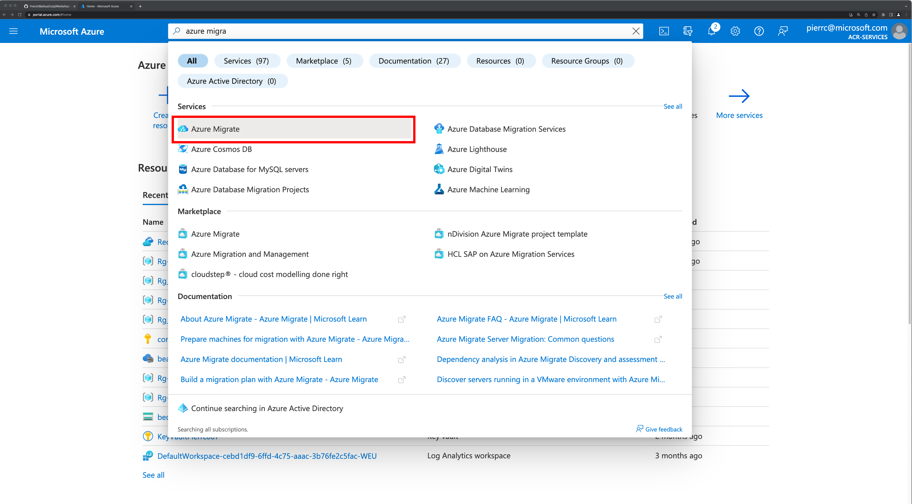
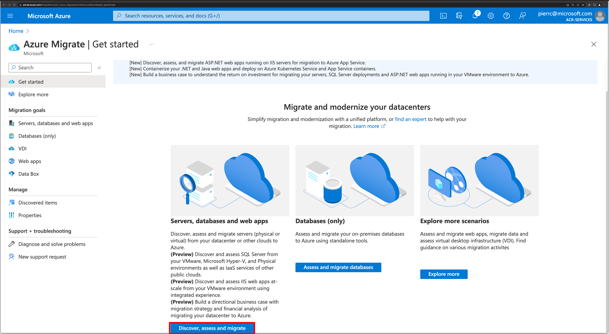
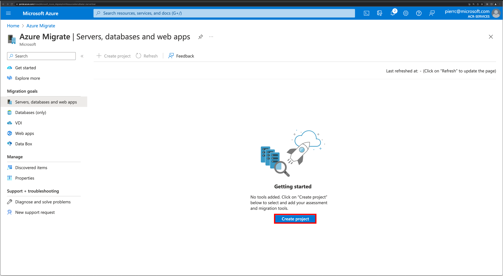
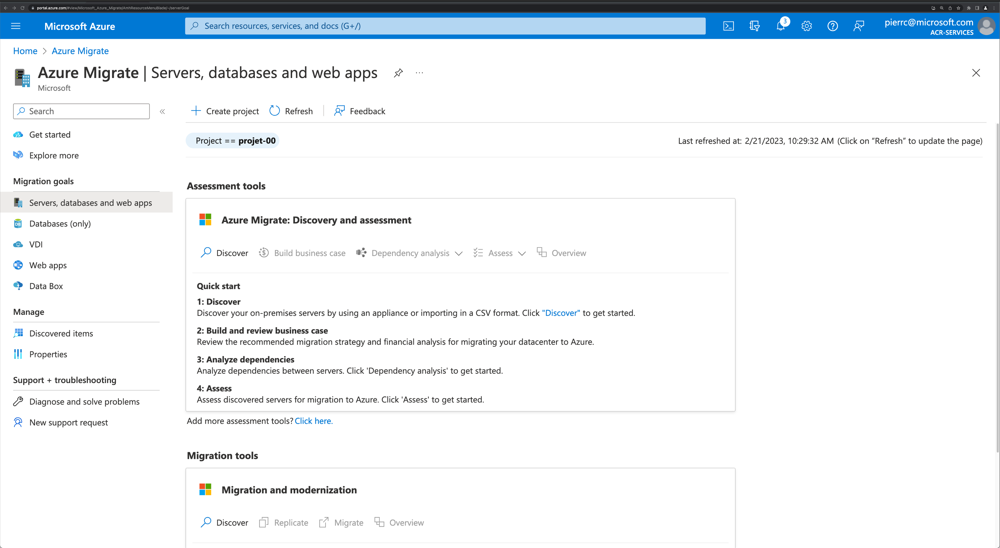
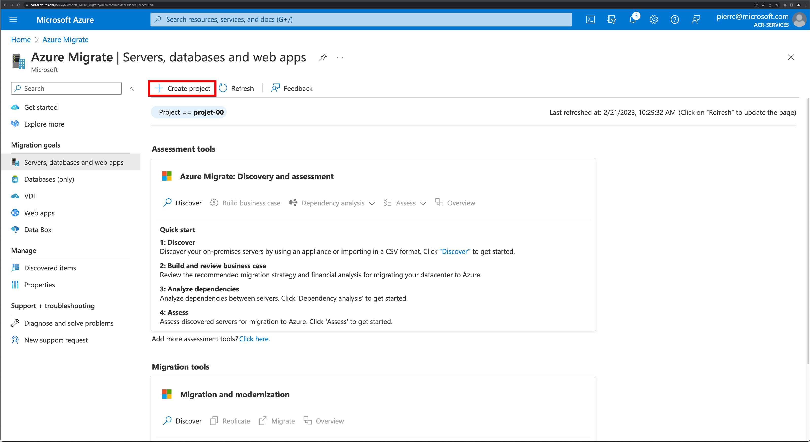
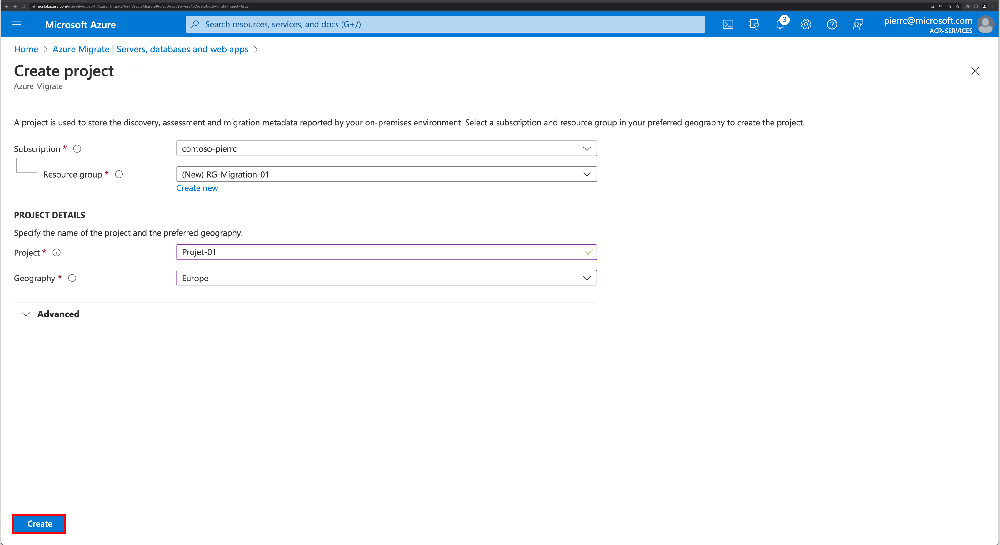

# Workshop-Migration
## Objectif:
L'objectif de ce Lab , c'est d'effectuer un assessment à partir d'un fichier CSV importé 
Documentations: https://learn.microsoft.com/fr-fr/azure/migrate/migrate-services-overview
## Pré-requis
Avoir un abonnement Azure avec un utilisateur ayant les droits Contributeur ou Propriétaire dans l’abonnement pour créer un projet.
### Création d'un projet
Il y deux possibilités pour créer un projet 
- l'abonnement n'a pas de projet de migration existant
- l'abonnement a déjà un ou des projets de migration(s)

-> l'abonnement n'a pas de projet de migration existant (option1)  
 
 
 
 
 
-> l'abonnement a déjà un ou des projets de migration(s) (option2)  
 
 
 
 
