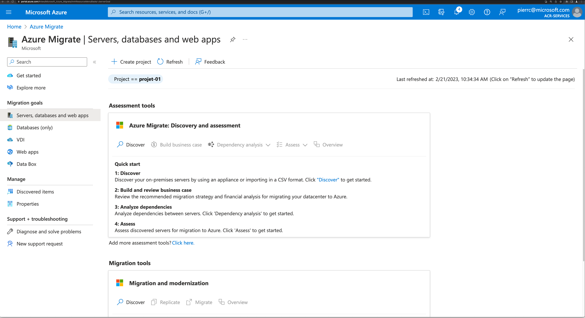

# Workshop-Migration
## Objectif:
L'objectif de ce Lab , c'est d'effectuer un assessment à partir d'un fichier CSV importé 
Documentations: https://learn.microsoft.com/fr-fr/azure/migrate/migrate-services-overview
## Pré-requis
Avoir un abonnement Azure avec un utilisateur ayant les droits Contributeur ou Propriétaire dans l’abonnement pour créer un projet.
### Création d'un projet
Il y deux possibilités pour créer un projet 
- l'abonnement n'a pas de projet de migration existant
- l'abonnement a déjà un ou des projets de migration(s)

-> l'abonnement n'a pas de projet de migration existant (option1)  
 
 
 
 
 
-> l'abonnement a déjà un ou des projets de migration(s) (option2)  
 
 
 
 
  
Pour naviguer entre projets 
  

### Découverte avec l'import d'un fichier CSV.
Récupérez le fichier CSV: 
https://storworkshops.blob.core.windows.net/workshopmigrate/Azure_Migrate_import_template.csv 
Dans votre projet: 
 
 
 
 
  

### Création d'un groupe.
Un assessment se fait uniquement depuis un groupe 
Revenir à la racime du projet 
 
 
 
 
 
 
 
 
 
 
 

